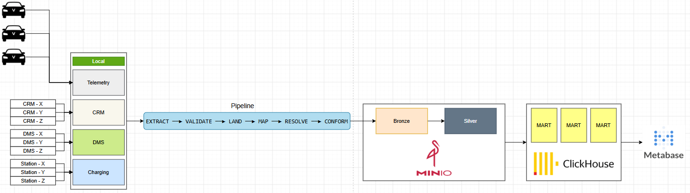
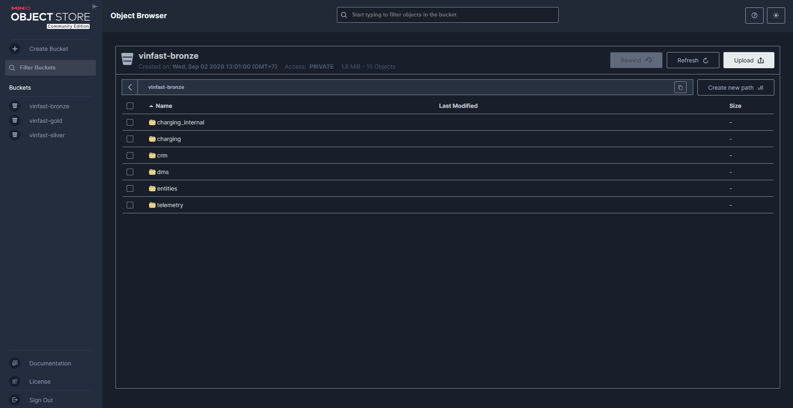
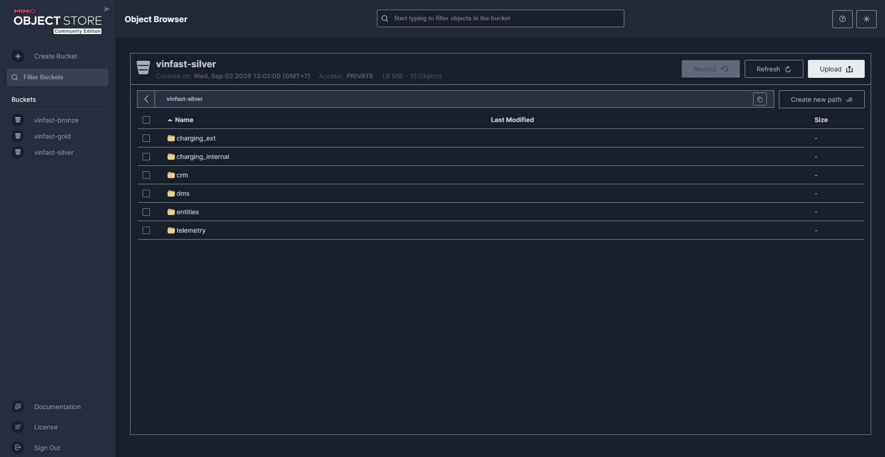
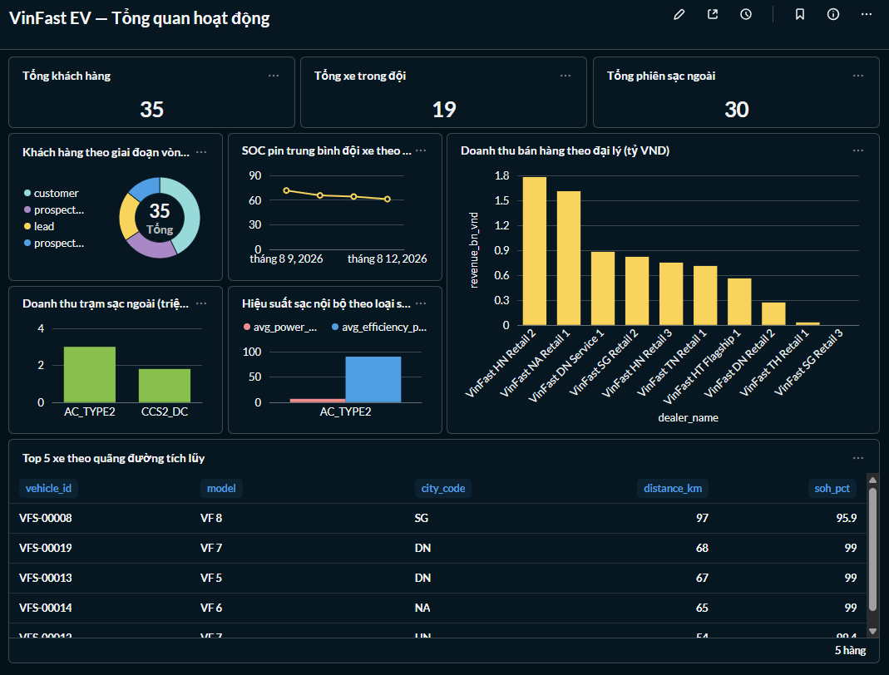
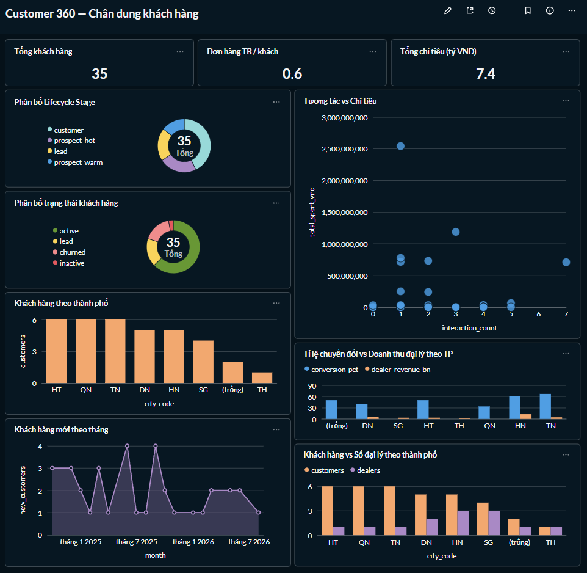
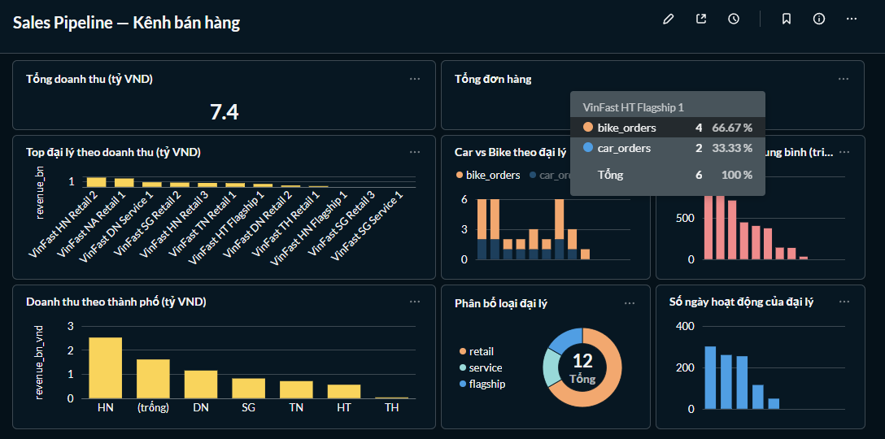
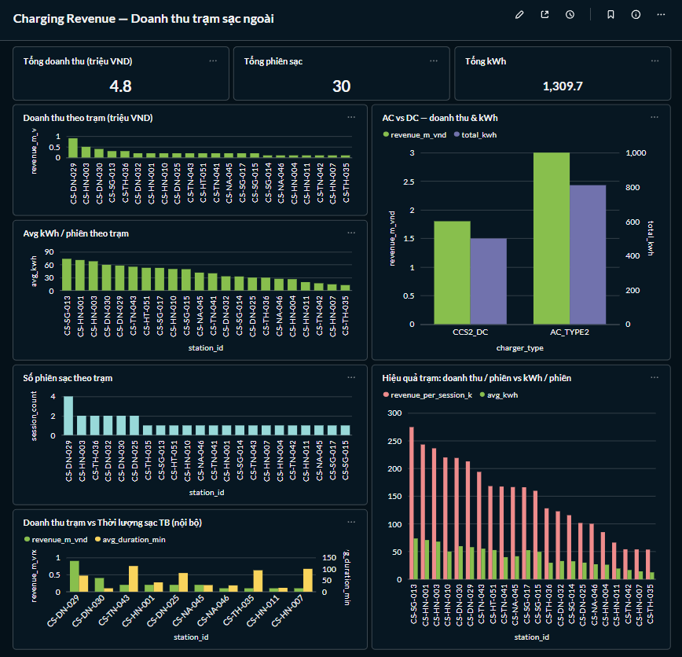
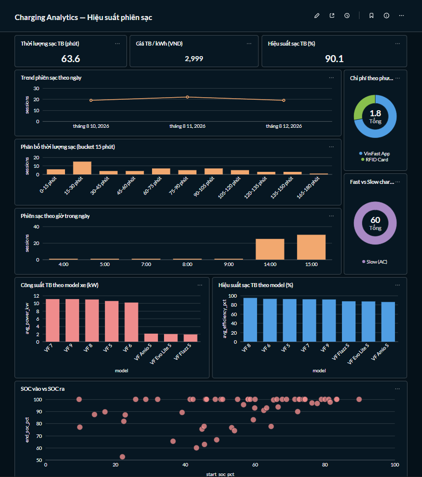
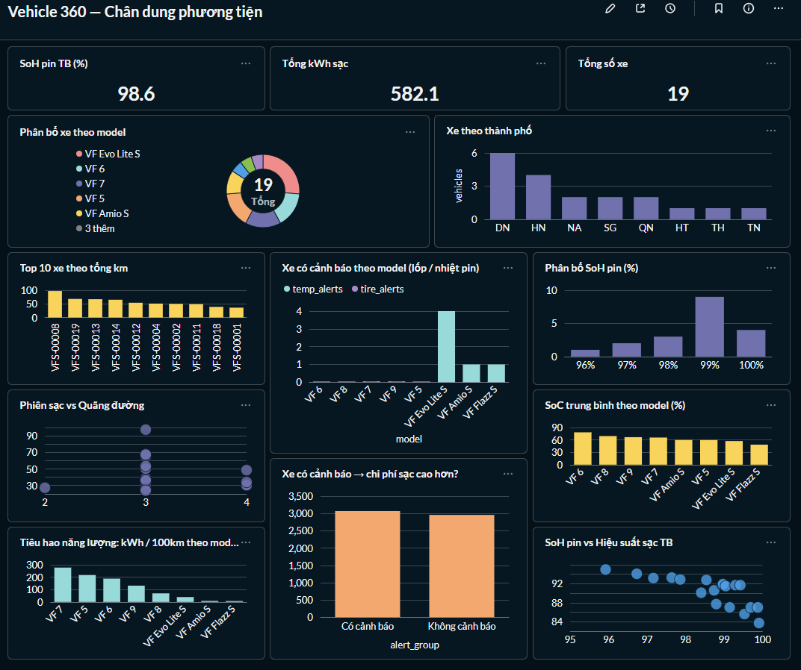
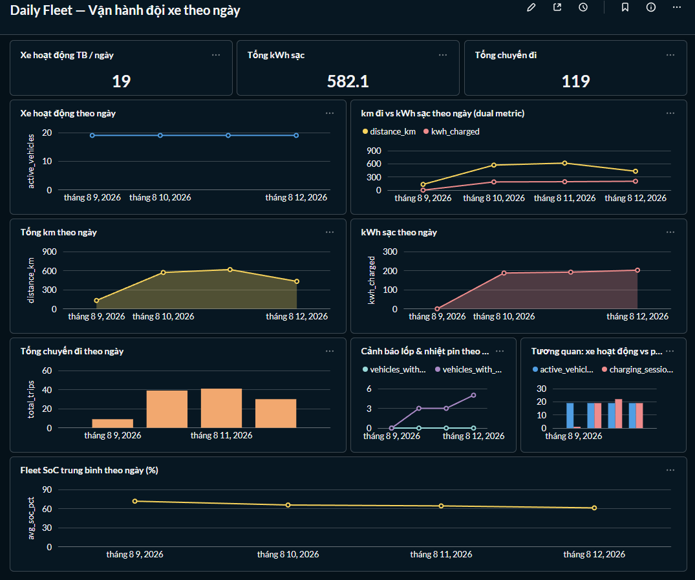

# VinFast EV Data Platform — Lakehouse Architecture (v1)

Nền tảng dữ liệu đa nguồn (CRM, DMS, Charging, Telemetry) theo mô hình **Lakehouse**:
MinIO làm source of truth (Bronze + Silver Parquet), ClickHouse chỉ giữ tầng Gold serving, dbt là transform layer duy nhất.

## Services & Credentials

| Service | URL / Port | Đăng nhập | Vai trò |
|---|---|---|---|
| MinIO S3 API | `http://localhost:9100` | `vinfast` / `vinfast123` | Object storage (bronze + silver + gold buckets) |
| MinIO Console | `http://localhost:9101` | `vinfast` / `vinfast123` | Quản lý bucket qua UI |
| ClickHouse HTTP | `http://localhost:8123` | `vinfast` / `vinfast123` (db `vinfast`) | Gold serving layer |
| Metabase | `http://localhost:3000` | (setup lần đầu) | Dashboard BI |

Buckets: `vinfast-bronze` · `vinfast-silver` · `vinfast-gold`

## Setup môi trường

```powershell
python -m venv .venv
.venv\Scripts\pip install -r requirements.txt
# Windows: bật UTF-8 cho console (tiếng Việt trong log)
$env:PYTHONUTF8 = 1
```

### ClickHouse driver cho Metabase

> [!IMPORTANT]
> File `Vinfast_v1/metabase/plugins/clickhouse.metabase-driver.jar`.
> Cần tải thủ công trước khi chạy `docker compose up`.

Tải bản mới nhất từ GitHub release của [metabase-clickhouse-driver](https://github.com/ClickHouse/metabase-clickhouse-driver/releases):

```powershell
# Tạo thư mục nếu chưa có
New-Item -ItemType Directory -Force -Path Vinfast_v1\metabase\plugins

# Tải driver (thay x.x.x bằng version mới nhất)
Invoke-WebRequest `
  -Uri "https://github.com/ClickHouse/metabase-clickhouse-driver/releases/download/1.8.5/clickhouse.metabase-driver.jar" `
  -OutFile "Vinfast_v1\metabase\plugins\clickhouse.metabase-driver.jar"
```

File JAR được mount vào container Metabase qua `docker-compose.yml`:
```
./metabase/plugins/clickhouse.metabase-driver.jar → /plugins/clickhouse.metabase-driver.jar
```

## Kiến trúc

```
┌─ SOURCES (synthetic, physical realism) ─────────────────────────────────────┐
│  [Telemetry]      [CRM]        [DMS]          [Charging Ext]                │
│  hive parquet     customer     sales_order    OCPP-style (70% VIN DMS)      │
│  3 ngày × ~12k    interaction  dealer         csv                           │
│  rows, 40 cột     csv          inventory csv  csv                           │
│                                                              data_generator  │
└──────┬───────────────┬──────────────┬──────────────────┬────────────────────┘
       ▼               ▼              ▼                  ▼
┌─ PIPELINE (metadata-driven, 6 bước × 6 nguồn YAML) ─────────────────────────┐
│  entities · telemetry · charging_internal · crm · dms · charging            │
│                                                                             │
│  EXTRACT ──► VALIDATE ──► LAND ──► MAP ──► RESOLVE ──► CONFORM               │
│  hive/csv/  contract    Bronze    rename  identity    derived + dedup       │
│  flat file  4 lớp QC    MinIO     norm    SQLite      partition/snapshot    │
│                                             (plugin 20% cho logic phức tạp) │
│  Plugin: charging_internal (battery_kwh enrich + 5 cột phái sinh)           │
└──────┬──────────────────────────────────────────────────────────────────────┘
       ▼
┌─ MinIO :9100 — SOURCE OF TRUTH ─────────────────────────────────────────────┐
│  vinfast-bronze  raw landed parquet (partition theo ingest_date)            │
│  vinfast-silver  chuẩn hóa + phái sinh                                     │
│    telemetry/{date}/data.parquet            (35k rows × 3 ngày)             │
│    charging_internal/{date}/data.parquet    (60 sessions)                   │
│    crm|dms|charging_ext/{entity}/{date}/data.parquet                        │
│    entities/{users|vehicles|stations}/data.parquet  ← snapshot ghi đè       │
│  vinfast-gold   (tùy chọn) backup mart parquet                             │
└──────┬──────────────────────────────────────────────────────────────────────┘
       ▼  dbt stg_* đọc s3() trực tiếp — KHÔNG còn bảng raw_* trung gian
┌─ ClickHouse :8123 — GOLD ONLY (dbt-managed) ────────────────────────────────┐
│  stg_* (8 views, s3() từ MinIO) → int_* (2) → mart_* (6 tables)             │
│  16 models · 26 tests PASS                                                  │
└──────┬──────────────────────────────────────────────────────────────────────┘
       ▼
┌─ SERVING — Metabase :3000 (7 dashboards, mỗi dashboard = 1 persona) ────────┐
│  /39 Tổng quan         → Ban điều hành   (cross-mart, quyết định chiến lược) │
│  /40 Customer 360      → Quản lý KH      (mart_customer_360)                 │
│  /41 Sales Pipeline    → Quản lý bán     (mart_sales_pipeline)               │
│  /42 Charging Revenue  → Quản lý đối tác (mart_charging_revenue)             │
│  /43 Charging Analytics→ Chuyên môn sạc  (mart_charging_analytics)           │
│  /44 Vehicle 360       → Kỹ thuật/BH     (mart_vehicle_360)                  │
│  /45 Daily Fleet       → Vận hành ngày   (mart_daily_fleet)                  │
└─────────────────────────────────────────────────────────────────────────────┘
```

### Sơ đồ kiến trúc & Storage



#### MinIO Storage Layers

| Bronze Layer (`vinfast-bronze`) | Silver Layer (`vinfast-silver`) |
|---|---|
|  |  |

## Chạy end-to-end

```powershell
# 0. Services (MinIO + ClickHouse + Metabase)
docker compose up -d

# 1. Sinh dữ liệu
python -m src.data_generator.cli generate --start-date 2026-08-10 --end-date 2026-08-12 --seed 42
python -m src.data_generator.cli mock-raw --source all --seed 42

# 2. Pipeline 6 nguồn → MinIO Bronze + Silver
python -m src.pipeline.cli list
python -m src.pipeline.cli run --source entities --date 2026-08-29
foreach ($d in @("2026-08-10","2026-08-11","2026-08-12")) {
  python -m src.pipeline.cli run --source telemetry --source charging_internal --date $d
}
python -m src.pipeline.cli run --source crm --source dms --source charging --date 2026-08-29

# 3. Gold: dbt → ClickHouse
cd dbt_project
python -m dbt.cli.main run --full-refresh --profiles-dir .
python -m dbt.cli.main test --profiles-dir .
```

## Onboarding nguồn mới (5 bước)

1. Phân tích bản ghi + trường map về canonical entity
2. `src/data_source/contracts/<source>.contract.json` — fields, PK, quality
3. `src/data_source/sources/<source>.yaml` — mapping/identity/dedup/derived
4. (Tuỳ chọn) plugin `src/pipeline/plugins/<source>.py` cho logic phức tạp
5. `python -m src.pipeline.cli run --source <tên> --date YYYY-MM-DD --dry-run` → verify

### Tham chiếu nhanh YAML config

```yaml
source:   { name, type: csv|parquet, connection: {path}, schedule: daily|hourly|event }
contract: { ref: contracts/<file>.json }
plugin:   { module: src.pipeline.plugins.<tên>, hooks: [pre_map|post_resolve|pre_conform] }  # tuỳ chọn
bronze:   { destination: s3://vinfast-bronze/<prefix>/, partition: [ingest_date] }
silver:   { destination: s3://vinfast-silver/<prefix>/, engine: pandas|spark,
            partition: [year,month,day] | [], snapshot: true|false }  # snapshot=true: dimension ghi đè key cố định
entities:
  - name / canonical_entity
    identity: { source_keys, canonical_key, strategy: match_or_create|match_required|match_or_null }
    mapping:  [ { source, canonical, transform: normalize_phone|parse_date|lower|upper } ]
    dedup:    { keys, order_by }
    quality:  { reject_on_error, min_rows }
```

## Data Marts (Gold — ClickHouse)

| Mart | Rows | Persona | Dashboard |
|---|---|---|---|
| `mart_customer_360` | 35 | Quản lý nghiệp vụ KH | [Customer 360](/dashboard/40) |
| `mart_sales_pipeline` | 12 | Quản lý nghiệp vụ bán hàng | [Sales Pipeline](/dashboard/41) |
| `mart_charging_revenue` | 22 | Quản lý đối tác trạm sạc | [Charging Revenue](/dashboard/42) |
| `mart_charging_analytics` | 60 | Chuyên môn / kỹ thuật sạc | [Charging Analytics](/dashboard/43) |
| `mart_vehicle_360` | 19 | Kỹ thuật / bảo hành chất lượng | [Vehicle 360](/dashboard/44) |
| `mart_daily_fleet` | 4 | Vận hành hàng ngày | [Daily Fleet](/dashboard/45) |

> Nguyên tắc: **mỗi dashboard = 1 persona = 1 mart** → đúng kiến trúc "dashboard theo đối tượng".
> Dashboard `/39` (Tổng quan) là cross-mart dành cho Ban điều hành, không gắn với mart cụ thể.

### Metabase Dashboards

#### Phân loại dashboard theo đối tượng sử dụng

| Đối tượng | Dashboard | Mục đích quyết định |
|---|---|---|
| **Ban điều hành** | [Tổng quan](/dashboard/39) | Quyết định chiến lược (cross-mart) |
| **Quản lý nghiệp vụ** | [Customer 360](/dashboard/40) | Quyết định chăm sóc khách hàng |
| | [Sales Pipeline](/dashboard/41) | Quyết định kênh bán hàng |
| | [Charging Revenue](/dashboard/42) | Quyết định đối tác trạm sạc |
| **Chuyên môn / Kỹ thuật** | [Charging Analytics](/dashboard/43) | Quyết định sản phẩm sạc |
| | [Vehicle 360](/dashboard/44) | Quyết định bảo hành / chất lượng |
| **Vận hành hàng ngày** | [Daily Fleet](/dashboard/45) | Quyết định điều phối ngày-to-ngày |

#### Screenshots

| Dashboard | Preview |
|---|---|
| Tổng quan (/39) |  |
| Customer 360 (/40) |  |
| Sales Pipeline (/41) |  |
| Charging Revenue (/42) |  |
| Charging Analytics (/43) |  |
| Vehicle 360 (/44) |  |
| Daily Fleet (/45) |  |

## Cấu trúc thư mục

```
Vinfast/
├── README.md                  # Tài liệu tổng quan kiến trúc & hướng dẫn vận hành
├── utils/                     # Ảnh minh họa kiến trúc & Metabase dashboard
└── Vinfast_v1/                # Thư mục mã nguồn chính của dự án
    ├── docker-compose.yml     # Cấu hình dịch vụ MinIO, ClickHouse & Metabase
    ├── requirements.txt       # Danh sách thư viện Python phụ thuộc
    ├── src/                   # Mã nguồn chính của ứng dụng
    │   ├── data_generator/    # Bộ sinh dữ liệu giả lập (Telemetry physics, CRM, DMS, Charging)
    │   │   ├── mock_data/     # Script sinh CSV mock (crm, dms, charging)
    │   │   ├── telemetry/     # Giả lập vật lý xe điện & phiên sạc
    │   │   ├── utils/         # Helper utility cho generator
    │   │   └── cli.py         # Interface CLI sinh dữ liệu
    │   ├── data_source/       # Cấu hình nguồn dữ liệu & Data Contracts
    │   │   ├── contracts/     # 6 file JSON định nghĩa schema & quy tắc QC
    │   │   └── sources/       # 6 file YAML cấu hình pipeline nguồn
    │   ├── pipeline/          # Framework xử lý dữ liệu 6 bước
    │   │   ├── plugins/       # Hook logic tùy chỉnh (enrichment)
    │   │   ├── cli.py         # Interface CLI vận hành pipeline
    │   │   ├── extractor.py   # Trích xuất dữ liệu thô
    │   │   ├── validator.py   # Kiểm tra chất lượng dữ liệu
    │   │   ├── lander.py      # Ghi dữ liệu vào Bronze MinIO
    │   │   ├── mapper.py      # Ánh xạ chuẩn hóa trường
    │   │   ├── resolver.py    # Xử lý định danh (Identity resolution SQLite)
    │   │   └── conformer.py   # Ghép chuẩn Silver Parquet
    │   └── spark_jobs/        # Spark session & Schema utilities
    ├── dbt_project/           # Dự án dbt quản lý tầng Gold trong ClickHouse
    │   ├── models/
    │   │   ├── staging/       # 8 staging views (đọc s3() từ MinIO)
    │   │   ├── intermediate/  # 2 models trung gian
    │   │   └── marts/         # 6 mart tables phục vụ báo cáo BI
    │   ├── dbt_project.yml    # Cấu hình dự án dbt
    │   └── profiles.yml       # Cấu hình kết nối ClickHouse
    ├── warehouse/ddl/         # Thư mục lưu DDL ClickHouse
    ├── metabase/              # Script khởi tạo dashboard & Metabase driver
    │   └── setup_dashboards.py
    ├── data/                  # Thư mục dữ liệu local (raw, bronze, mapping, quality_reports, rejected)
    └── logs/                  # Log vận hành pipeline và dbt
```
